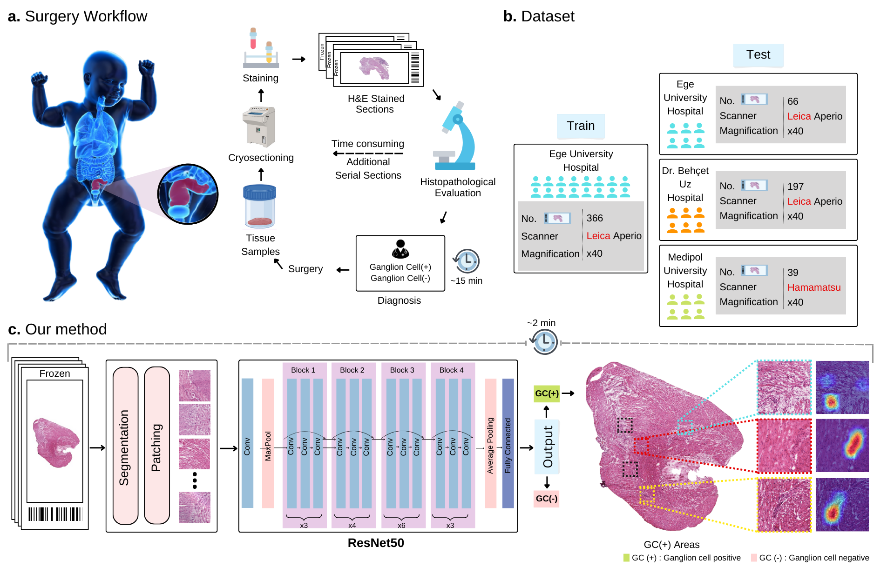

# The Future of Surgical Diagnostics: AI-Enhanced Detection of Ganglion Cells for Hirschsprung Disease 


### [Paper]() | [Train Dataset](https://istanbuledutr-my.sharepoint.com/:f:/g/personal/yasindurusoy_ogr_iu_edu_tr/EgpNPBGQjIlLsmy1yY6OjOkBcOX2zxbTH7Gc76nzt03YOA) |  [Test Datasets](https://istanbuledutr-my.sharepoint.com/:f:/g/personal/yasindurusoy_ogr_iu_edu_tr/EuMBe9bGtStNrf7KGVpb78EBEGs2gpwlLUqlJ0Ll3DvMwg) | [Pretrained Model](https://istanbuledutr-my.sharepoint.com/:u:/g/personal/yasindurusoy_ogr_iu_edu_tr/EYUaLO4zNHtPiLyFKmdDwPUB11dgwklyMnwYU-r33ZlDZQ?e=qxIQlA) 

## Prerequisites
- Python 3
- CPU or NVIDIA GPU + CUDA CuDNN

### Getting started

- Clone this repo:
```bash
git clone https://github.com/FerasAlaqad/Ganglion-Detector
cd Ganglion-Detector
```
- For pip users, please type the command `pip install -r requirements.txt`.

- For Conda users,  you can create a new Conda environment using `conda env create -f environment.yml`.
### Training and Testing

The data used for training and testing expected to be organized as follows:
```bash
Data_Path                # DIR_TO_TRAIN_DATASET
 ├──  Ege_Hospital_Train
 |   ├── P
 |      ├── 1.png     
 |      ├── ...
 |      └── n.png
 |   ├── n
 |      ├── 1.png     
 |      ├── ...
 |      └── n.png
 ├──  Ege_Hospital_Internal_Test
 |   ├── P
 |      ├── 1.png     
 |      ├── ...
 |      └── n.png
 |   ├── n
 |      ├── 1.png     
 |      ├── ...
 |      └── n.png 
 ├──  Behcet_Hospital_External_Test
 |   ├── P
 |      ├── 1.png     
 |      ├── ...
 |      └── n.png
 |   ├── n
 |      ├── 1.png     
 |      ├── ...
 |      └── n.png 
 ├──  Medipol_Hospital_External_Test
 |   ├── P
 |      ├── 1.png     
 |      ├── ...
 |      └── n.png
 |   ├── n
 |      ├── 1.png     
 |      ├── ...
 |      └── n.png


```

Before running the training and inference scripts, please make sure to edit the config files to set the necessary parameters.

- Train the Ganglion-Detector model:
```bash
python train.py
```

- Test the Ganglion-Detector  model:
```bash
python inference.py
```
The test results will be saved to results folder. 


